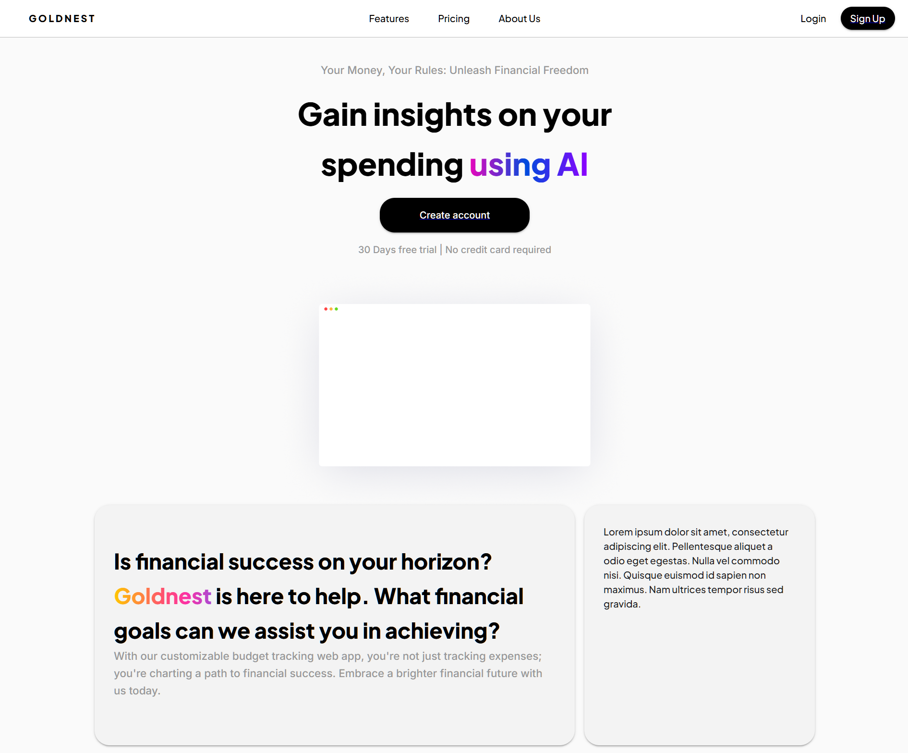
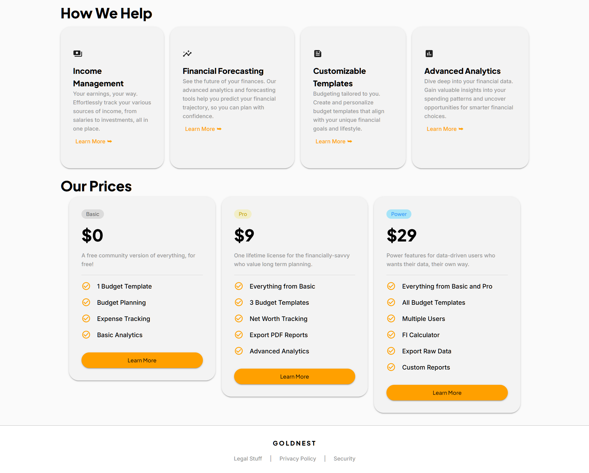

# Goldnest - Your Money, Your Rules

# Project Description

This project is a full-stack Django+React application designed and developed by me. Goldnest is a personal finance application that allows for dynamic category creation, a stunning visual dashboard, and detailed reports and analytics available to dive deep into your spending habits.

Watch the demo here!
[](https://www.youtube.com/watch?v=Lis2se-W8F8&feature=youtu.be)

# Tech Stack

Backend:

- Django 4.2.2 (Python web framework)
- Django REST Framework (API development)
- Fernet encryption for secure data storage
- SQLite database (local development)

Frontend:

- React 18.2.0
- Material-UI (MUI) v5.14.7
- React Router v6.15.0
- Chart.js & D3.js for data visualization
- Three.js/Framer Motion for animations

# Installation Instructions

This project has been containerized with Docker (although not uploaded to DockerHub), and is available to run on your local machine after doing the following.

`docker compose -f docker-compose.dev.yml up --build`

To login, the default superuser is:

```
username: admin
passsword: pass
```

# Visuals



